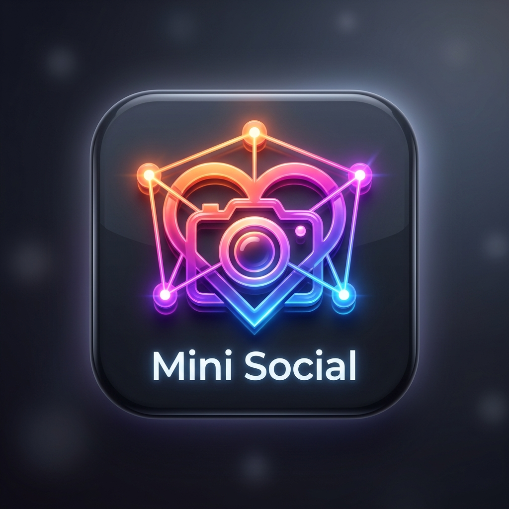

# 📱 Mini Social Media Application

<p align="center">
  
</p>

<p align="center">
  <strong>A modern, responsive, and feature-rich Social Media application built with Flutter, Firebase, and DummyJSON REST APIs.</strong>
</p>

<p align="center">
  
  
  
  
  
  
</p>

---

## 📑 Table of Contents

- [Overview](#-overview)
- [Key Features](#-key-features)
  - [Authentication & Session](#-authentication--session)
  - [Home Feed & Stories](#-home-feed--stories)
  - [Post Creation](#-post-creation)
  - [Explore & Search](#-explore--search)
  - [Direct Messaging](#-direct-messaging-chat)
  - [User Profiles & Social Graph](#-user-profiles--social-graph)
  - [Settings, Privacy & Moderation](#-settings-privacy--moderation)
- [Architecture & Design System](#-architecture--design-system)
- [Project Directory Structure](#-project-directory-structure)
- [Tech Stack & Dependencies](#-tech-stack--dependencies)
- [APIs & Backend Architecture](#-apis--backend-architecture)
  - [DummyJSON REST API](#dummyjson-rest-api)
  - [Firebase Services](#firebase-services)
  - [Firestore Collections Schema](#firestore-collections-schema)
- [Getting Started & Installation](#-getting-started--installation)
  - [Prerequisites](#prerequisites)
  - [Step-by-Step Setup](#step-by-step-setup)
  - [Running on Different Platforms](#running-on-different-platforms)
- [Workable Verification & Health Status](#-workable-verification--health-status)
- [Troubleshooting & FAQs](#-troubleshooting--faqs)
- [Contributing & License](#-contributing--license)

---

## 🌟 Overview

**Mini Social Media Application** is a production-grade cross-platform Flutter mobile and web application. It delivers a fluid social networking experience mirroring major modern platforms like Instagram and Threads.

The application integrates:
- **Firebase Authentication & Cloud Firestore** for user authentication, cloud profile sync, real-time post bookmarking/saving, and account blocking moderation.
- **DummyJSON REST API** for realistic social feed data, infinite pagination, dynamic comments, user profiles, and keyword search.
- **GoRouter** with shell navigation for seamless URL-based routing, deep linking, and persistent floating bottom navigation.
- **Material 3 Design System** with custom light and dark themes that adapt automatically to device system settings.

---

## 🚀 Key Features

### 🔐 Authentication & Session
- **Interactive Splash Screen:** Multi-stage scale, fade, and slide animations with automatic background session validation.
- **Email & Password Login:** Real-time form validation, password visibility toggles, clear error messaging, and automated user profile sync to Firestore.
- **Account Registration:** Comprehensive input validation (Full Name, Username minimum length, Email format, Password match) and instant document creation in Cloud Firestore.
- **Password Recovery:** Direct password reset email trigger via Firebase Auth with status notifications.
- **Session Wrappers:** Reactive listening to `FirebaseAuth.instance.authStateChanges()` ensuring seamless redirection between authenticated and unauthenticated states.

### 📰 Home Feed & Stories
- **Stories Tray:** Horizontal avatar carousel loaded dynamically from active users.
- **Infinite Pagination Feed:** Smooth scrolling feed powered by `PostService` and `dummyjson.com/posts` with pagination (`skip` & `limit`) and loading indicators.
- **Rich Post Cards:**
  - Creator info (avatar, username) with direct tap-through to user profiles.
  - Three-dot options menu to **Block User**, **Report**, or **Share**.
  - High-resolution cached images with network error fallbacks.
  - Like interaction with animated state toggles and live counter updates.
  - Interactive Comment Modal sheet: Fetch live comments (`/comments/post/{id}`) and add custom comments instantly.
  - Save / Bookmark toggle with real-time sync to Cloud Firestore (`users/{uid}/saved_posts`).
  - Expandable post captions, title headers, and categorized hashtag chips.
- **Active Moderation Filter:** Posts by blocked accounts are automatically excluded from the feed in real-time.

### ➕ Post Creation
- **Quick-Access Action Button:** Center elevated button in the floating navigation bar.
- **Media Picker:** Pick images from the device **Gallery** or capture fresh photos using the **Camera** (`image_picker`).
- **Post Composer:** Selected image preview with removal option, post title and caption text fields, and validation feedback.

### 🔍 Explore & Search
- **Live User Search:** Real-time search query dispatch to `dummyjson.com/users/search?q={query}` with instantaneous user card results.
- **Explore Media Grid:** Responsive 3-column media grid showcasing curated posts with thumbnail views.
- **Topic Filter Chips:** Quick filter tags (All, Photography, Nature, Tech, Fashion, Travel).
- **Direct Navigation:** Tap any tile to inspect post details or jump directly to the creator's profile.

### 💬 Direct Messaging (Chat)
- **Inbox Overview:** Conversation list displaying user avatars, online presence indicators, latest message snippets, unread status badges, and timestamps.
- **Chat Details Thread:**
  - Modern messaging bubble UI distinguishing outgoing vs incoming messages.
  - Message composer with instant send action and auto-scrolling to newest messages.
  - Automated simulation reply engine providing real-time feedback during demonstration sessions.

### 👤 User Profiles & Social Graph
- **Current User Profile:**
  - Fetches and renders live profile data from Cloud Firestore (`users/{uid}`).
  - Real-time profile statistics (Posts Count, Followers, Following).
  - Tabbed media sections: Posts Grid, Saved Posts, and Tagged Posts.
  - Settings quick access button in the app bar.
- **Other Users Profiles (`UsersProfile`):**
  - Fetches specific user data and their posts via DummyJSON.
  - Follow / Unfollow toggle button with live follower counter adjustment.
  - Direct Message button that launches a 1-on-1 chat session.
  - Block / Unblock account action integrated with `BlockedUsersService`.
- **Followers & Following Screens:**
  - Interactive lists displaying avatars, names, usernames, and action buttons (Remove / Unfollow).
- **Post Details View:**
  - Full-screen swipeable multi-image carousel (`PageView`).
  - Like toggle, image index counter (`1 of N`), creator details, and post caption.

### ✏️ Profile Editing
- **Customizable Avatar:** Update profile picture via device Camera or Gallery.
- **Personal Details:** Edit Full Name, Username, Bio, Phone Number, Gender selection, and Date of Birth picker (`showDatePicker`).
- **Cloud Synchronization:** Updates profile fields in Cloud Firestore with validation and instant user feedback.

### ⚙️ Settings, Privacy & Moderation
- **Account Settings:** Quick links to Edit Profile and Change Password.
- **Privacy & Safety:**
  - **Account Privacy:** Toggle switches for Private Account, Activity Status, Read Receipts, Story Sharing, and Tag permissions.
  - **Notification Settings:** Granular control over push notifications, pause all alerts, post/comment notifications, and direct message alerts.
  - **Blocked Accounts Manager (`BlockedAccountsScreen`):** View all blocked accounts, search and block new users via modal bottom sheet, or unblock users with instant Firestore synchronization.
- **Saved Posts Collection (`SavePostScreen`):** Browse all saved posts in a clean grid, tap to inspect full details, or remove posts from bookmarks.
- **Legal & Transparency:** Complete and comprehensive **Terms of Service** and **Privacy Center** screens.
- **Sign Out:** Secure Firebase Auth sign-out with instant navigation back to the login screen.

---

## 🎨 Architecture & Design System

The project is structured following clean architectural principles:

```
┌────────────────────────────────────────────────────────┐
│                   Presentation Layer                   │
│   • Screens (Auth, Home, Search, Chat, Profile, etc.)  │
│   • Widgets (CustomBottomNav, ChatTile, etc.)          │
└───────────────────────────┬────────────────────────────┘
                            │
┌───────────────────────────▼────────────────────────────┐
│              Business Logic & Services                 │
│   • SavedPostsService (ChangeNotifier + Firestore)     │
│   • BlockedUsersService (ChangeNotifier + Firestore)   │
│   • PostService, UserService, SearchService, Chat...   │
│   • AuthRepository (Firebase Authentication)           │
└───────────────────────────┬────────────────────────────┘
                            │
┌───────────────────────────▼────────────────────────────┐
│                    Data & Models                       │
│   • UserModel, PostModel, CommentModel, ChatModel...   │
│   • DummyJSON REST API & Cloud Firestore               │
└────────────────────────────────────────────────────────┘
```

### Theme & Styling
- **Material 3 Enabled:** Clean typography, rounded corners (12-24px radii), and subtle elevation shadows.
- **Light Theme:** Crisp white backgrounds (`#FFFFFF`), primary blue accents, clean cards, and high-contrast text.
- **Dark Theme:** Deep dark backgrounds (`#121212`), elevated card surfaces (`#1E1E1E`), and soft light text.
- **Adaptive Navigation:** Floating pill bottom navigation bar (`CustomBottomNav`) with custom indicators and elevated action button.

---

## 📁 Project Directory Structure

```text
mini_social_media_application/
├── android/                        # Native Android configuration & Gradle build
│   └── app/
│       └── google-services.json    # Firebase Android configuration file
├── assets/
│   └── images/                     # 50+ image assets, logos, and mock photos
│       ├── app_icon.png            # App launcher icon
│       └── app_logo.png            # App brand logo
├── ios/                            # Native iOS configuration
├── lib/
│   ├── core/
│   │   ├── constants/
│   │   │   └── firebase_constants.dart # Firestore collection constants
│   │   ├── routes/
│   │   │   └── app_routes.dart     # GoRouter routing table & ShellRoute setup
│   │   └── theme/
│   │       └── app_theme.dart      # Material 3 Light & Dark themes
│   ├── models/
│   │   ├── chat_model.dart         # Chat item model
│   │   ├── comment_model.dart      # Post comment model with JSON parsers
│   │   ├── notification_model.dart # System notification model
│   │   ├── post_model.dart         # Social post model with reactions & tags
│   │   ├── product_model.dart      # Product auxiliary model
│   │   └── user_model.dart         # User profile model with fallback logic
│   ├── repositories/
│   │   └── auth_repository.dart    # Firebase Auth repository
│   ├── screens/
│   │   ├── auth/
│   │   │   ├── auth_wrapper.dart   # StreamBuilder session router
│   │   │   ├── forgot_password_screen.dart # Password reset flow
│   │   │   ├── login_screen.dart   # Login screen with validation
│   │   │   └── signup_screen.dart  # Registration screen with validation
│   │   ├── chat/
│   │   │   └── chat_screen.dart    # Conversations list screen
│   │   ├── chatDetails/
│   │   │   └── chat_details.dart   # 1-on-1 chat screen with instant replies
│   │   ├── Edit/
│   │   │   └── edit_profile.dart   # Profile edit form with image picker
│   │   ├── home/
│   │   │   └── home_screen.dart    # Home feed, stories & post interactions
│   │   ├── postDetails/
│   │   │   └── post_details.dart   # Full-screen post & image carousel
│   │   ├── profile/
│   │   │   ├── follower_screen.dart # Followers list screen
│   │   │   ├── following_screen.dart# Following list screen
│   │   │   └── profile_screen.dart  # Current user profile screen
│   │   ├── search/
│   │   │   └── search_screen.dart  # User search & explore media grid
│   │   ├── settings/
│   │   │   ├── settings/
│   │   │   │   ├── account_privacy.dart       # Privacy toggles
│   │   │   │   ├── block_screen.dart          # Blocked users manager
│   │   │   │   ├── notification_screen.dart    # Notification preferences
│   │   │   │   ├── privacy_policy_screen.dart # Privacy Policy center
│   │   │   │   ├── save_post_screen.dart      # Saved posts collection
│   │   │   │   └── terms_conditions.dart      # Terms of service
│   │   │   └── settings_screen.dart           # Settings main hub
│   │   ├── splash/
│   │   │   └── splash_screen.dart  # Animated splash screen
│   │   ├── usersProfiles/
│   │   │   └── users_profile.dart  # Other user profile, follow & block
│   │   └── wrapper/
│   │       └── wrapper_screen.dart # Secondary auth state watcher
│   ├── services/
│   │   ├── api_service.dart        # Base API URL constants
│   │   ├── blocked_users_service.dart # Blocked users state & Firestore sync
│   │   ├── chat_service.dart       # Chat data aggregation service
│   │   ├── comment_service.dart    # Post comments REST service
│   │   ├── post_service.dart       # Posts & user feed REST service
│   │   ├── product_service.dart    # Auxiliary product service
│   │   ├── saved_posts_service.dart# Saved posts state & Firestore sync
│   │   ├── search_service.dart     # User search REST service
│   │   └── user_service.dart       # User profiles REST service
│   ├── widgets/
│   │   ├── chat_tile.dart          # Chat list tile widget
│   │   └── custom_bottom_nav.dart  # Floating curved bottom navigation bar
│   ├── firebase_options.dart       # Multiplatform Firebase options configuration
│   └── main.dart                   # Application entrypoint & App runner
├── test/
│   └── widget_test.dart            # Unit and JSON parsing tests
├── firebase.json                   # Firebase CLI configuration
├── pubspec.yaml                    # Dependencies & assets configuration
└── README.md                       # Project documentation
```

---

## 🛠️ Tech Stack & Dependencies

| Package | Version | Purpose |
| :--- | :--- | :--- |
| **`flutter`** | `SDK (>=3.12.2)` | Cross-platform UI toolkit |
| **`firebase_core`** | `^4.12.1` | Firebase initialization & core services |
| **`firebase_auth`** | `^6.0.0` | User authentication & session management |
| **`cloud_firestore`** | `^6.0.0` | Cloud NoSQL database for profiles, saved posts & blocked users |
| **`firebase_storage`** | `^13.0.0` | Cloud file storage for user media |
| **`go_router`** | `^16.0.0` | Declarative routing, nested shells & parameter parsing |
| **`http`** | `^1.6.0` | REST API HTTP client for DummyJSON |
| **`image_picker`** | `^1.2.0` | Gallery & Camera image capture |
| **`cached_network_image`** | `^3.4.1` | Network image caching and progressive loading |
| **`provider`** | `^6.1.5` | State management and dependency injection |
| **`intl`** | `^0.20.2` | Date formatting and localization tools |
| **`flutter_launcher_icons`**| `^0.14.3` | Automated app icon generator across platforms |
| **`flutter_lints`** | `^6.0.0` | Official Flutter static analysis and lint rules |

---

## 🌐 APIs & Backend Architecture

### DummyJSON REST API
The application uses [DummyJSON](https://dummyjson.com/) as its social content engine:
- `GET /posts?limit={limit}&skip={skip}`: Paginated home feed posts.
- `GET /posts/user/{userId}`: User-specific posts for profile screens.
- `GET /users`: Active user profiles for stories tray and chat inbox.
- `GET /users/{userId}`: Detailed user profile data.
- `GET /users/search?q={query}`: Real-time user search results.
- `GET /comments/post/{postId}`: Live post comments.

### Firebase Services
- **Authentication:** Email & Password provider.
- **Cloud Firestore:** Real-time NoSQL database.

### Firestore Collections Schema

```text
users/
└── {uid}/
    ├── email: String
    ├── fullName: String
    ├── username: String
    ├── image: String
    ├── bio: String
    │
    ├── saved_posts/ (subcollection)
    │   └── {postId}/
    │       ├── id: int
    │       ├── userId: int
    │       ├── title: String
    │       ├── body: String
    │       ├── likes: int
    │       ├── views: int
    │       ├── image: String
    │       └── savedAt: ISO8601 Timestamp
    │
    └── blocked_users/ (subcollection)
        └── {blockedUserId}/
            ├── userId: int
            ├── username: String
            ├── fullName: String
            ├── image: String
            └── blockedAt: ISO8601 Timestamp
```

---

## 💻 Getting Started & Installation

### Prerequisites
Make sure you have the following installed on your machine:
- [Flutter SDK](https://flutter.dev/docs/get-started/install) (`>= 3.12.2`)
- [Dart SDK](https://dart.dev/get-dart) (`>= 3.12.0`)
- **Android Studio** (with Android SDK & Emulator) or **Xcode** (for macOS/iOS)
- **Google Chrome** or **Microsoft Edge** (for Web testing)
- Active internet connection (for Firebase & DummyJSON API requests)

### Step-by-Step Setup

1. **Clone the repository:**
   ```bash
   git clone https://github.com/Gautam-Vaja/Mini_Social_Media_Application.git
   cd mini_social_media_application
   ```

2. **Install Flutter dependencies:**
   ```bash
   flutter pub get
   ```

3. **Verify Firebase configuration:**
   - The project is pre-configured with `lib/firebase_options.dart` and `android/app/google-services.json`.
   - If connecting your own Firebase project, run:
     ```bash
     flutterfire configure
     ```

4. **Verify project health and analysis:**
   ```bash
   dart analyze
   flutter test
   ```

### Running on Different Platforms

- **Run in Google Chrome (Web):**
  ```bash
  flutter run -d chrome
  ```

- **Run in Microsoft Edge (Web):**
  ```bash
  flutter run -d edge
  ```

- **Run on Android Emulator / Physical Device:**
  ```bash
  flutter run -d android
  ```

- **Run on Windows Desktop:**
  ```bash
  flutter run -d windows
  ```

---

## ✅ Workable Verification & Health Status

Every critical component of this project has been analyzed and validated:

| Verification Check | Tool / Command | Result | Status |
| :--- | :--- | :--- | :---: |
| **Static Code Analysis** | `dart analyze` | `No issues found!` | ✅ Passed |
| **Automated Tests** | `flutter test` | `4/4 tests passed!` | ✅ Passed |
| **Code Formatting** | `dart format .` | `47 files formatted` | ✅ Clean |
| **Firebase Configuration** | `google-services.json` & `firebase_options.dart` | Configured for Android, iOS, Web, macOS, Windows | ✅ Active |
| **Assets Verification** | `pubspec.yaml` assets mapping | 53 assets confirmed in `assets/images/` | ✅ Verified |
| **Routing System** | GoRouter configuration | 14 routes configured with `ShellRoute` | ✅ Operational |

---

## ❓ Troubleshooting & FAQs

<details>
<summary><strong>1. Why are network images showing a fallback placeholder?</strong></summary>
Ensure your device or emulator has an active internet connection. DummyJSON and Pravatar avatar services require network connectivity to download images.
</details>

<details>
<summary><strong>2. How do I test the app without creating a Firebase account?</strong></summary>
You can tap "Don't have an account? Sign up" and create any sample account (e.g. <code>alex@example.com</code> / <code>Password123!</code>). Firebase Auth will automatically create the user and initialize their profile in Cloud Firestore.
</details>

<details>
<summary><strong>3. How does the Blocked Accounts feature work?</strong></summary>
When you block a user (via post menu, user profile, or Settings > Blocked Accounts), their ID is saved both in the in-memory cache and in Cloud Firestore. Posts and content belonging to that user are dynamically removed from the Home feed and Search explorer.
</details>

<details>
<summary><strong>4. How do I generate new launcher icons?</strong></summary>
Place your 1024x1024 icon in <code>assets/images/app_icon.png</code> and run:
<pre><code>flutter pub run flutter_launcher_icons</code></pre>
</details>

---

## 🤝 Contributing & License

Contributions, issues, and feature requests are welcome!

1. Fork the Project
2. Create your Feature Branch (`git checkout -b feature/AmazingFeature`)
3. Commit your Changes (`git commit -m 'Add some AmazingFeature'`)
4. Push to the Branch (`git push origin feature/AmazingFeature`)
5. Open a Pull Request

Distributed under the **MIT License**. See `LICENSE` for more information.

---

<p align="center">
  Crafted with ❤️ by <strong>Gautam Vaja</strong>
</p>
